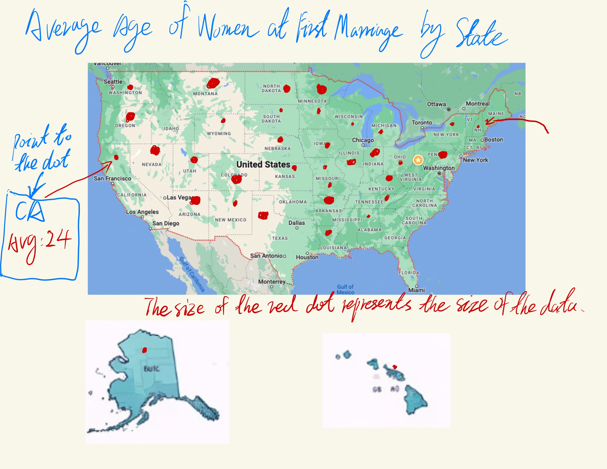

# Step 1: Choosing Data Visualization
[Average Age of Women at First Marriage by State](https://www.reddit.com/r/dataisbeautiful/comments/wzx70h/average_age_of_women_at_first_marriage_by_state/)
## Reason for Choosing this data visualization
### Complexity for General Audience: 
A scatter plot can be somewhat complex for a general audience to understand if they are not familiar with interpreting statistical graphs.
### Overlapping Data Points:
In areas where the data points are densely packed, it might be difficult to distinguish between them, which can obscure patterns and trends.
### No Temporal Dimension:
The visualization shows a snapshot in time and does not provide any trend data, which would be helpful to see if patterns are stable, increasing, or decreasing over time.

# Step 2: My data visualization sketch

