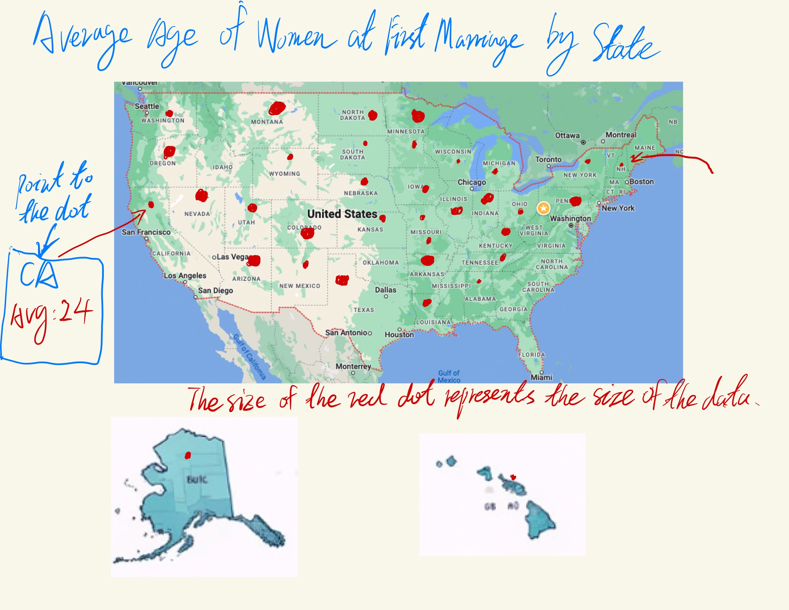

# Step 1&2: Choosing Data Visualization
[Average Age of Women at First Marriage by State](https://www.reddit.com/r/dataisbeautiful/comments/wzx70h/average_age_of_women_at_first_marriage_by_state/)
## Reason for Choosing this data visualization
### Complexity for General Audience: 
A scatter plot can be somewhat complex for a general audience to understand if they are not familiar with interpreting statistical graphs.
### Overlapping Data Points:
In areas where the data points are densely packed, it might be difficult to distinguish between them, which can obscure patterns and trends.
### No Temporal Dimension:
The visualization shows a snapshot in time and does not provide any trend data, which would be helpful to see if patterns are stable, increasing, or decreasing over time.

# Step 3: My data visualization sketch

## The reason why I choose this visualization approach:
### Geographical Context: 
By placing the data points on a map, viewers can immediately see the geographical distribution of the data. This helps in understanding regional patterns at a glance.
### Intuitive Representation: 
The use of varying dot sizes to represent the size of the data (presumably the average age or the number of records per state) provides an intuitive way to grasp the relative magnitude of the values across states.
### Visual Appeal:
A map with data points can be visually engaging and can draw the viewer's attention more effectively than a graph or chart.

# Step 4: Feedback from others
- Can you tell me what you think this is?
  
  My dad: Ah, this looks like one of those newfangled data maps, doesn't it? They're all the rage in the academies and think tanks, I hear.
  
  My elder sister: Well, it's a map of the United States, and it's got these red dots scattered all over it. Each dot is a different size, and there's writing that says the size of the dots represents the average age of women when they marry for the first time, and it's by state. If you put your finger on one of those dots—hypothetically, of course, since this is just paper—it would tell you the state and the average age there.

- Is there anything you find surprising or confusing?
  
  My dad: I must say, it's a bit unconventional. I'm used to seeing numbers and charts in the newspaper, but this is more visual, isn't it?

  My elder sister: It's a bit confusing, though, because there's no scale for the dot sizes. How much bigger is a dot for 30 years old compared to one for 25? It's not clear.

# Step 5: Final version of the work
I referred to their opinions and the shortcomings of my sketch, so I made the following adjustments to the final version of the work:
## Clarity and Avoidance of Overlap:
I ‘ve chosen a clear and legible way to display each state by hax map, which immediately tells the viewer that this is a map related to the United States. Moreover，Using hexbins avoids the problem of overlapping data points that can occur in dot maps, especially in areas with many data points close together.
## Legend and Scale:
Although my sister mentioned the lack of a scale for dot sizes, the color scale on the right provides a reference for interpreting the average age values, which is a crucial element in any data visualization.
## Inclusion of Time Frames:
I've included checkboxes for different time frames, which suggests that the viewer can select different periods to see how the average age has changed over time. This adds a dynamic element to the visualization.

  

