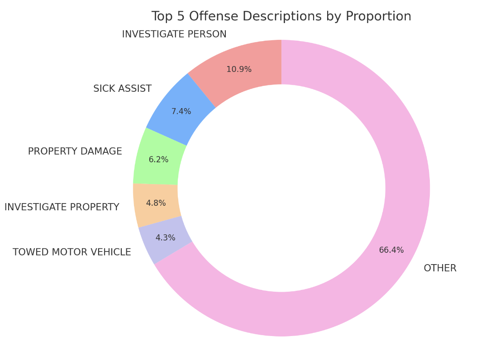

# Part 1
## Outline
The objective of this project is to delve into the intricate details of crime patterns in Boston, utilizing the rich dataset provided. At its core, the project aims to unearth underlying trends and correlations within the data, such as the frequency and types of crimes, their geographic distribution, and temporal patterns. The goal is to provide actionable insights that could guide policy decisions, enhance public safety, and contribute to academic discourse on urban crime dynamics.

By leveraging data visualization and analytical techniques, this project will bring to light the nuances of urban crime. It's not just about presenting numbers; it's about telling the story of a city through its data and identifying areas for improvement in public safety and crime prevention strategies.

I hope using the way of data visualization revealing the evolving landscape of crime in Boston, with a focus on unearthing patterns, hotspots, and temporal shifts.
### Project structure:
#### Introduction: Setting the Stage
High-Level Summary: Exploring Boston's 2022 crime data to reveal trends and patterns, emphasizing the importance of this analysis for public safety and policy formulation.
#### The Story Arc: From Data to insight
Setup: Presenting Boston's crime situation through data visualization.
Conflict: Highlighting challenges in crime management, safety issues, and areas of concern.
Resolution: Suggesting potential solutions and preventive measures based on the analysis.
#### User Stories: Perspectives on Crime
Policymakers: Identifying resource allocation and policy development needs.
Residents: Offering insights for personal safety and community awareness.
Tourists: Giving travelling suggestions to make sure their safety.

#### Emerging Insights: Beyond the Numbers
Synthesizing findings to offer a narrative on Boston's crime dynamics.
Discussing implications for policy, community engagement.

#### Conclusion: A Call to Action
Recapitulating key findings.
Proposing steps  to address crime in Boston.

## Sketch of the project

Using pie chart, lines chart and heatmap to gain general overview for the Boston's crime incidents.

## Data Source
[Link for the data source](https://data.boston.gov/dataset/crime-incident-reports-august-2015-to-date-source-new-system/resource/313e56df-6d77-49d2-9c49-ee411f10cf58)
I plan to use the time, location and the crimes' categories for the data visualization of the final project.

## Method and the medium.
May be I would choose Shorthand or a html file to show all the visualization results in one page for my final project.

# Part 2
## StoryBoarding and Wireframing

### User Research Protocol
**Target Audience:** Policymakers, residents, and tourists in Boston.

**Approach to identifying representative individuals:** Since direct access to my target audiences is limited, we will engage with a diverse proxy group to gather a range of perspectives. This group will comprise: Two students from Heinz College.

| Prompt | Feedback |
| ------ | -------- |
|*First impressions?* |The presentation "Decoding Crime in Boston: A Data-Driven Approach" seems to be a comprehensive analysis of crime in the city of Boston, utilizing various data visualization tools to convey information. It likely provides a detailed look into crime patterns, frequency, and types, along with geographic analysis to understand regional differences within the city.|
|*What do you think the purpose of this is?* | Crime Pattern Analysis: By breaking down crime into various categories and analyzing their frequency and timing, the presentation aims to identify patterns that could reveal underlying causes or trends.For example, the heatmap and district analysis can indicate which areas might need more policing or community support. Moreover, The information about high crime areas can be used to advise residents and tourists on safety precautions.|
|*Who do you think this is for?* | This presentation is likely intended for city officials,  possibly the general public of Boston, and the tourists.|
|*What is confusing about this?* | Titles and Subtitles: Make sure each chart screams what it's about. Clear, catchy, can't miss it. Narrative Flow: Like a good book, your data should tell a story from start to finish. Guide your readers through the journey of understanding. Break Down 'Other': That 'Other' slice of the pie is like a mystery box. Dive in there, and give us the juicy details. What crimes are hiding in there?|
| *What would you change?* | Clarify Visualization Titles: Make sure each visualization has a descriptive title that clearly indicates what the viewer is looking at. For example, "Top 5 Offense Descriptions" could be more informative. Detailed Legends and Labels: Ensure that all parts of the graphics, especially the pie chart, have clear legends and labels so that readers can easily understand what each segment represents. Contextualize with Benchmarks: Compare the data to previous years or other cities to provide context that can highlight trends or particular issues of concern.Segment the 'Other' Category: Break down the 'Other' category to show more granular details about those offenses, providing a fuller picture of the crime landscape.Call to Action: After presenting the data, include a section on implications or recommended actions to engage the audience further and prompt a response.

### What I need to revise
#### Clarify Visualization Titles: 
Make sure that each visualization has a descriptive title that clearly indicates what the viewer is looking at. For example, instead of "Top 5 Offense Descriptions," use a title that provides more informative context.

#### Adding context before the plot
Adding context like Narrative flow, guide the readers  through the journey of understanding and give them a backstory.

#### Contextualize with Benchmarks: 
Compare the data to previous years or other cities to provide context that can highlight trends or particular issues of concern.

#### Adding Call to Action
After presenting the data, include a section on implications or recommended actions to engage the audience further and prompt a response.

### moodboard
[preview](https://preview.shorthand.com/4kGdbUQgDwCMZZeG)

# Part 3
## Intended Audience:
The audience for the final data story includes policymakers, Boston residents, and tourists. Each group has distinct needs and perspectives on the data. Because I did not have access to such a unique target audience, I can only be inspired by some statistical websites about Boston crime data, and analyze the time, place and crime characteristics to think about the problem from the perspective of intended audience.

The biggest headache for me is how to find appropriate data so that I can express a data story with clear and reasonable logical thinking. In order to better obtain the data I want in crime location analysis, I looked around for an outline map of Boston's Police district, so that from the perspective of data visualization, the audience can obtain and understand the information more intuitively, and also allow them to feel that data is not a cold number, but a tool that can bring the warmth of information

## Design Decisions
In fact, I originally wanted to tell the story simply from the perspective of time, place and crime classification, because through this logical chain, the audience can follow the ideas of my data story and understand what I want to express through the data. information, but after passing the interview, I found that there are still some detailed ideas that need to be modified, such as:
### Contextualization: 
Added benchmarks and comparisons to provide a better understanding of the data in a broader context, such as trends over time or comparisons with other cities.
### Narrative Flow: 
Improved the story flow to guide readers smoothly from introduction to conclusion, ensuring a logical and engaging progression of information.
### Call to Action: 
Incorporated actionable insights and recommendations, especially for policymakers and community leaders, based on the data findings.

In addition, I considered providing a motive for this story, so that the whole story forms a logical chain.

### Updated Data Source
1.[Source](https://data.boston.gov/dataset/boston-police-stations): Information of Boston police stations.

2.[Source](https://police.boston.gov/districts/): Boston area police district

3.[Source](https://ucr.fbi.gov/crime-in-the-u.s/2019/crime-in-the-u.s.-2019/tables/table-8/table-8-state-cuts/massachusetts.xls): FBI in Massachustts

4.[Source](https://www.city-data.com/crime/crime-Boston-Massachusetts.html): crime information in Boston

5.[Source](https://www.neighborhoodscout.com/ma/boston/crime): history crime data
